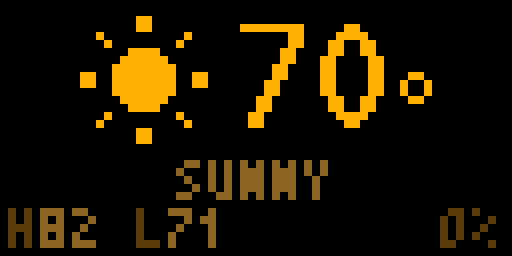
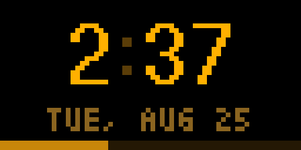
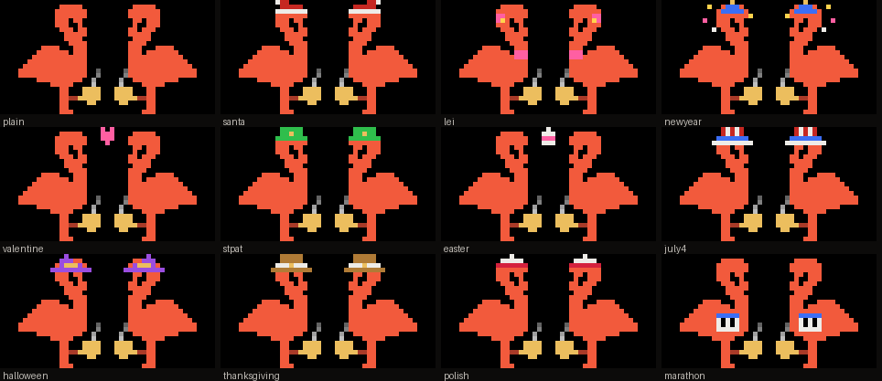

# tidbyt-apps

Custom apps for a Tidbyt (64×32 LED matrix) in a warm-dark espresso
palette, pushed standalone by GitHub Actions — no home machine involved.

| App | Preview | What it shows |
|---|---|---|
| **logo** |  | The Kaleidoscope Coffee mark: two flamingos leaning in over a pair of espresso cups, steam off the crema. They dress for the occasion, and they sleep when the shop is shut. |
| **news** | — | Greenpoint headlines (Greenpointers + Brooklyn Paper RSS), vertical scroll, breaking-news state |
| **weather** |  | Current temp, animated pixel-art conditions, daily high/low, precip chance (NWS + Open-Meteo blend, no API keys) |
| **clock** |  | Gold digits, blinking colon, date, seconds bar *(experimental — see note)* |

## Run them on your own Tidbyt

The official Tidbyt community catalog stopped accepting new apps after the
Modal acquisition, so this ships as a self-serve repo instead:

1. **Fork this repo** (keep it public — the free private-repo Actions quota
   won't cover the run frequency).
2. Add repo secrets (Settings → Secrets and variables → Actions):
   - `TIDBYT_DEVICE_ID` — Tidbyt app → device → settings → Get API key
   - `TIDBYT_API_TOKEN` — same screen
3. Enable the workflow(s) you want on the Actions tab (forks start with
   workflows disabled) and trigger each once via *Run workflow*.
4. For the weather app, edit the NWS gridpoint URLs at the top of
   `weather/weather.star` for your location: fetch
   `https://api.weather.gov/points/{lat},{lon}` and copy the `forecast`
   and `forecastHourly` URLs it returns. (US only — NWS.)

If you run a [Tronbyt](https://github.com/tronbyt) (self-hosted firmware)
instead, you don't need the push machinery — drop the `.star` files into
your server's apps folder.

## How the push model works

A Tidbyt shows whatever WebP it was last pushed. The weather app is a
short looping animation re-pushed every 10 minutes — a natural fit.

The news app is the awkward case: GitHub throttles free-tier cron to roughly
every 1–3 hours, so `push-news.yml` keeps a single run alive for ~5.5 hours
pushing every 10 minutes, with the next scheduled run queued behind it. That
is why it carries a `concurrency` block and a 355-minute timeout.

The logo card looks like the easy case and isn't. Its artwork never changes,
but what it *renders* does: it picks a costume from the date, and decides
whether the birds are awake or asleep from the shop's opening hours. A pushed
WebP is frozen until it is replaced, so the push cadence is what the card's
accuracy depends on — birds still asleep at 10am would be worse than not
having the feature. A costume only needs a daily push; an 8am open and a 5pm
close do not. So `push-logo.yml` uses the same self-looping trick as the news
app, pushing every 15 minutes, which bounds how stale the card can be at a
boundary. Its animation is a 3.2-second seamless loop precisely because the
device only buffers a short chunk of a pushed WebP and replays it — anything
longer would visibly stall (see the clock note below).

The clock is harder: it pre-renders future frames at 1 fps so the display
ticks between pushes, but **stock Tidbyt hardware only buffers a small
chunk of a long animation and loops it**, so the minute can stick. Treat
`clock` as experimental on stock devices; it works properly on Tronbyt,
where the server renders continuously. Pin any clock-style app so
rotation doesn't restart its animation.

## Local development

```bash
pixlet serve weather/weather.star   # live preview at localhost:8080
pixlet render weather/weather.star --gif --magnify 8 -o preview.gif
```

Pixlet quirk: keep each app in its own directory — two `.star` files in
one folder confuse the loader.

### Opening hours

Outside shop hours the birds sleep: heads folded back over their bodies, no
steam because the machines are off, and a pair of "z"s drifting up between
them. A closed card with no motion at all would read as a crashed display
rather than a shut shop, so the z's are doing real work.

| | Open |
|---|---|
| Mon–Thu | 8am – 5pm |
| Fri–Sun | 8am – 6pm |

Hours live in `make_frames.py` and are baked into the app. Note that a pixlet
time value has **no weekday attribute** — `now.format("Mon")` is how you get
one.

They still dress while they sleep, which is the intended behaviour: a
flamingo roosting in a Santa hat is the best thing this card does all year.

Force either state for a look:

```bash
pixlet render logo/kaleidoscope.star state=asleep costume=santa --gif --magnify 6 -o /tmp/x.gif
```

### The logo card's wardrobe



| When | Costume |
|---|---|
| 14 Feb | a heart between the two heads |
| 17 Mar | green leprechaun hat, gold buckle |
| Easter | a decorated egg between them |
| 3 May | white-over-red caps — Polish Constitution Day, Greenpoint's own |
| 1 Jun – 31 Aug | flower leis and a bloom at the ear |
| 4 Jul | Uncle Sam hats |
| 27–31 Oct | witch hats |
| NYC Marathon | race bibs — one of the shop's biggest days |
| Thanksgiving | pilgrim hats |
| 1–30 Dec | Santa hats |
| 31 Dec – 1 Jan | party hats and confetti |
| everything else | undressed |

Every wardrobe ships inside `kaleidoscope.star` and the app picks one from
`time.now()` at render time. Verified that all 5,479 days from 2026 to 2040
map to exactly one costume, and that narrow occasions beat the broad seasons
they sit inside — the Fourth of July outranks the summer lei, New Year's Eve
outranks Santa.

Easter, Thanksgiving and the Marathon move around the calendar, so they are
resolved to real dates by the generator and shipped as a lookup table.
Computing them in Starlark would be a lot of arithmetic to get subtly wrong
and no way to test it. Extend `MOVABLE_YEARS` before 2040.

Preview one out of season without waiting a year:

```bash
pixlet render logo/kaleidoscope.star costume=halloween --gif --magnify 6 -o /tmp/x.gif
```

Costumes are transparent overlays stacked on the art and keyed by **pose**,
not by frame: a costume only cares which way the head is turned, and there
are four head positions awake plus one asleep, against 48 frames. Baking a full frame set per
costume costs ~19KB of base64 each and does not scale to a wardrobe; this
way each one costs a few hundred bytes. `logo/costumes.png` is regenerated
by the same script, so the sheet above cannot drift from the code.

### Regenerating the logo card's frames

```bash
python3 logo/make_frames.py     # needs Pillow + numpy
```

It recomposes the flamingos from the shop's logo artwork at full resolution —
head and neck are split off as their own layer along a slanted cut and
rotated about the neck base — and only then downscales to 26px, so every pose
keeps the logo's true proportions. The bottom band (legs, perch line, cups,
feet) is hand-authored pixel geometry instead, because at 26px the downscale
smears it. Costumes anchor to the head's own downscaled bitmap so they ride
the nod rather than floating where the head used to be. Edit the constants at
the top and re-run; it rewrites `logo/kaleidoscope.star` in place. Don't
hand-edit the base64 blobs.

This is the one script here that is not fork-friendly: it reads a source logo
by absolute path from outside the repo. You don't need it to *run* the app —
`kaleidoscope.star` is committed and self-contained — only to change the art.

Things the generator refuses to do quietly, because each of them once
produced valid-looking output that was wrong: it fails if the source logo is
not the 1024×1024 export the crop constants were measured against, and fails
again if the crop catches the wrong number of opaque pixels (a re-export that
merely *shifted* the artwork passes a dimension check and silently crops 40%
less of the mark). It asserts the loop invariants too — the steam wave must
divide the frame count, the sprite must stay an odd width, every costume the
calendar names must exist, and the frame after the last must render
byte-identical to the first.

`logo/push.sh` pushes from a laptop, reading the API token from
`~/.config/tidbyt/token` and the device id from `~/.config/tidbyt/device_id`
(both chmod 600). Neither is ever written into a tracked file. Remove the app
from a device with:

```bash
# Disable push-logo.yml on the Actions tab first -- a run mid-loop will just
# push it straight back, which looks like the delete failing.
pixlet delete --api-token "$(cat ~/.config/tidbyt/token)" \
  "$(cat ~/.config/tidbyt/device_id)" logo
```

### Things the panel taught us

- The device this was designed against is mounted **portrait**, which is
  worth knowing before judging any layout.
- **1px lines do not read.** The matrix puts a black gutter between every
  diode, so a single-pixel leg becomes a column of separate dots and the bird
  looks like it is standing beside its legs. Legs are 2px. Judge pixel art by
  simulating those gutters, not by magnifying a render.
- Two shades of one hue barely separate at panel brightness — don't rely on
  it to carry a shape. A caramel pilgrim hat on a coral bird needed a white
  band across it before it stopped reading as a smudge.
- **Nothing may be black**, since the background is. A witch hat is purple.
  The one exception is unlit pixels *inside* a lit shape — the number strokes
  on the marathon bib work precisely because white surrounds them.
- Small shapes want one hue. Alternating colours inside a 3px-wide band
  dissolve it; save the colour play for something big enough to hold it.
- Check contrast against black. A gray below about 2:1 simply is not there on
  a lit floor.

Clock config params: `frames` (seconds of animation, default 150),
`offset` (seconds to lead real time by, to cancel push latency), `$tz`
(default America/New_York).
